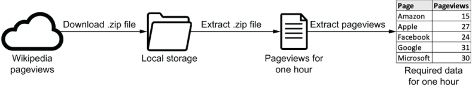

# Templating Operator Arguments

STEP 1. Download `.zip` file

_from Wikipedia pageviews to Local storage_

STEP 2. Extract `.zip` file

_to make Pageviews for one hour from Local storage_

STEP 3. Extract pageviews

_to make required data for one hour by extracting the pageviews_

